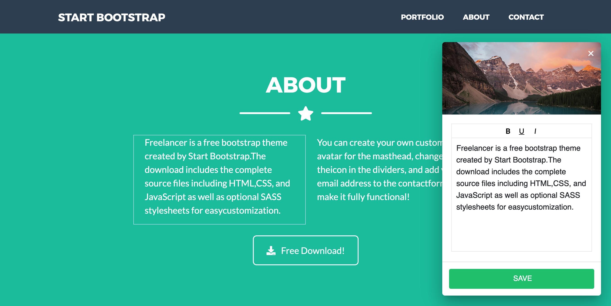

# :pencil2: Netlify Inline Editor

On-page editor for static sites that saves to Github via Netlify Identity. Written in vanilla js.

## Demo

Try it out by creating an account on:
https://inline-editor.netlify.app/edit/

After login, you'll be redirected to the main page, where you can edit the page by just clicking on the element you want to edit. Changes will be saved as json, and loaded when you refresh the page.

## Preview
Just click on an element to edit it.

## Automatic Setup

## Manual Setup

1. Clone this repo
2. Set up a site on Netlify and enable Netlify Identity and Git Gateway
3. Log in via /edit
4. Start editing your page by clicking on the elements you want to edit.

## How to make elements on a page editable

To make an element editable via the CMS, just give it an `id` and a class of `cms-editabe`. The CMS will automatically detect what kind of element it is, and show the appropriate input.
