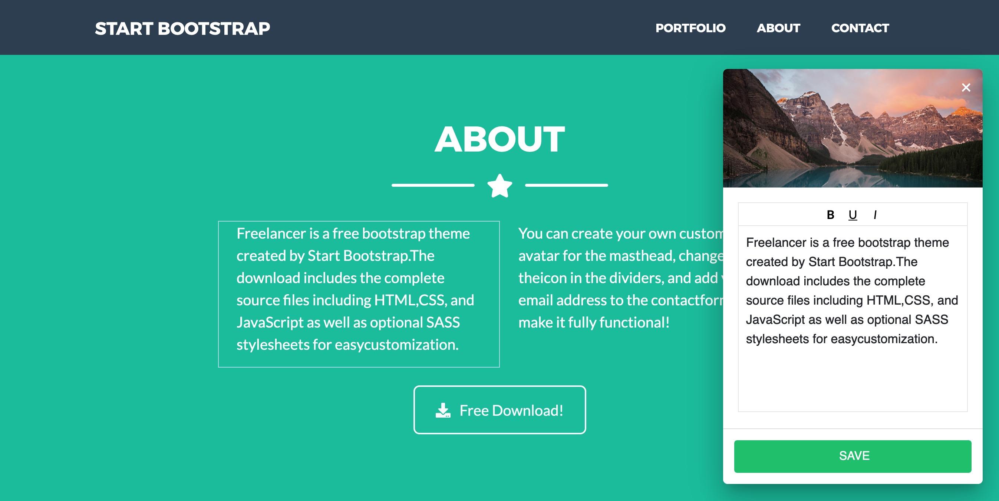

# :pencil2: Netlify Inline Editor

On-page editor for static sites that saves to Github via Netlify Identity. Written in vanilla js.

## Demo

Try it out by creating an account on:
https://inline-editor.netlify.app/edit/

After login, you'll be redirected to the main page, where you can edit the page by just clicking on the element you want to edit. Changes will be saved as json, and loaded when you refresh the page.

## Preview



_Just click on an element (left) to edit it in the overlay (right)._

## How to set up

### 1. Clone this repo

Clicking the button below will automatically clone this repo to your own Github account, create a new Netlify website and configure Netlify Identity.

<a href="https://app.netlify.com/start/deploy?repository=https://github.com/dashpilot/netlify-inline-editor&stack=cms"></a>

### 2. In Netlify

Create the following environment variables:

`S3_ENDPOINT`: your S3/Spaces endpoint (e.g ams3.digitaloceanspaces.com)\
`S3_KEY`: your S3/Spaces key\
`S3_SECRET`: your S3/Spaces secret\
`S3_BUCKET`: your S3/Spaces bucket\
`S3_URL`: full URL to your S3/Spaces bucket, WITH trailing slash (e.g. https://mybucket.ams3.digitaloceanspaces.com/)\

## How to make elements on a page editable

To make a part of the page editable, just give the container element a class of `editable` and an `id`, and give the child elements you wish to be editable a `data-name` attribute. For example:

```
<section class="editable" id="my-first-section">
        <h1 data-name="title">Hello World</h1>
        <small data-name="subtitle">This is a subtitle</small>
</section>
```

In this example, the container element ('section') has a class of `editable` and an id of "my-first-section". The editable elements (`h1` and `small`) both have a `data-name` attribute. The CMS will store this as:

```
{
  "my-first-section":
    {
        "title":"Hello World",
        "subtitle":"This is a subtitle"
    }
}
```

The CMS will also automatically detect what kind of element it is, and show the appropriate input.

## Press the :star: button
Don't forget to press the :star: button to let me know I should continue improving this project.
